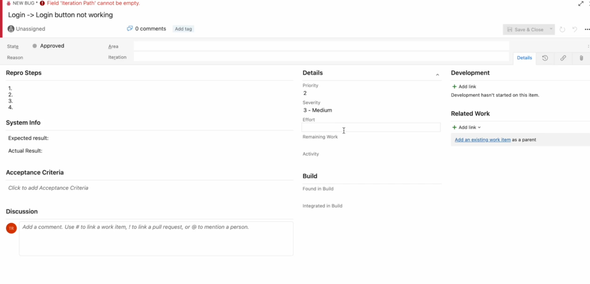

# Azure DevOps Bug Report – OpenCart Demo

## 📌 BUG-A001: Login button not working  

**Repro Steps:**  
1. Open OpenCart demo login page  
2. Enter valid username and password  
3. Click **Login** button  

**System Info**  
- **Expected Result:** User is logged in and redirected to dashboard  
- **Actual Result:** Login button is unresponsive, user not logged in  

**Acceptance Criteria:**  
- Login button must submit the form and authenticate user  
- Redirect must occur to dashboard after successful login  

**Details:**  
- **Priority:** 2 (High)  
- **Severity:** 3 - Medium  
- **Status:** Approved  

  
