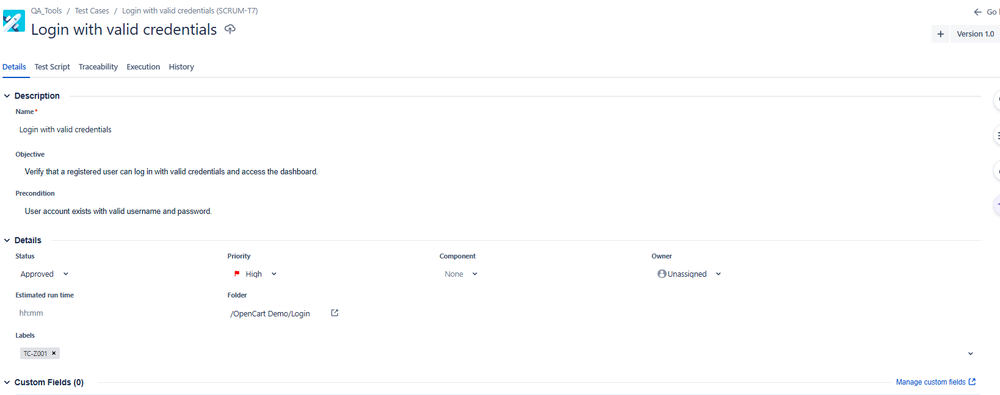
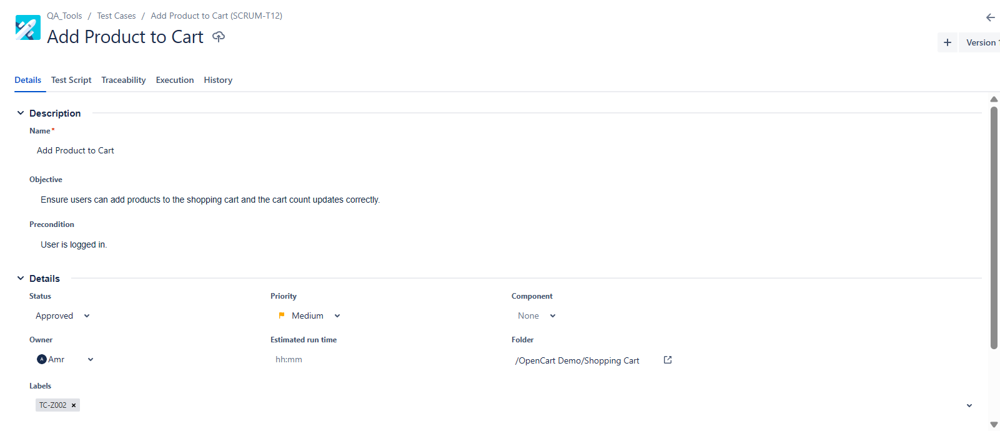
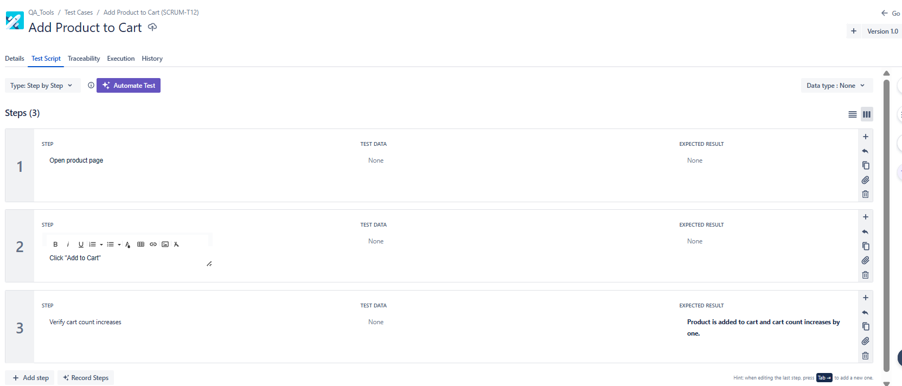
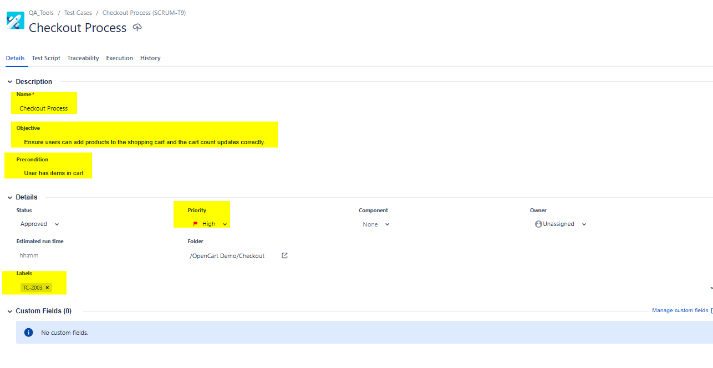
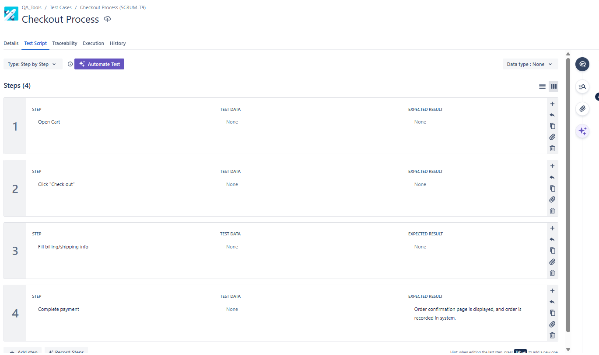
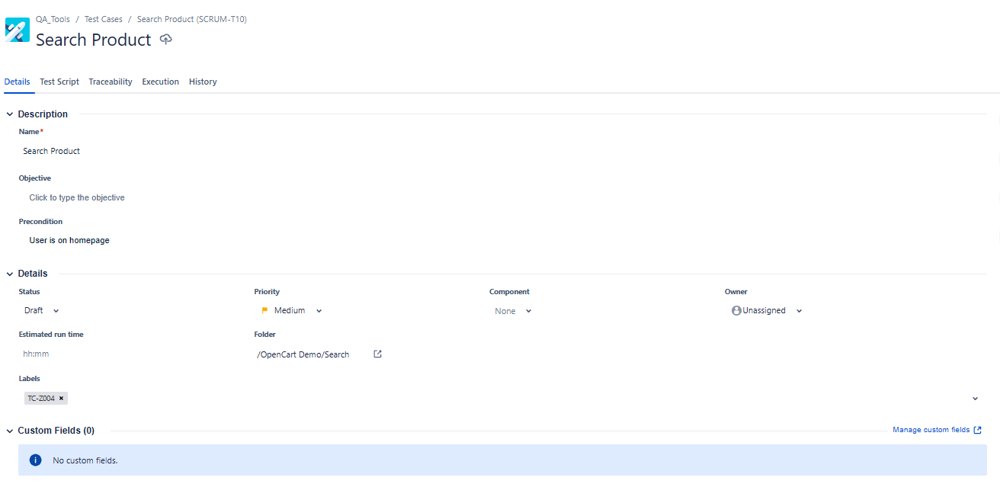
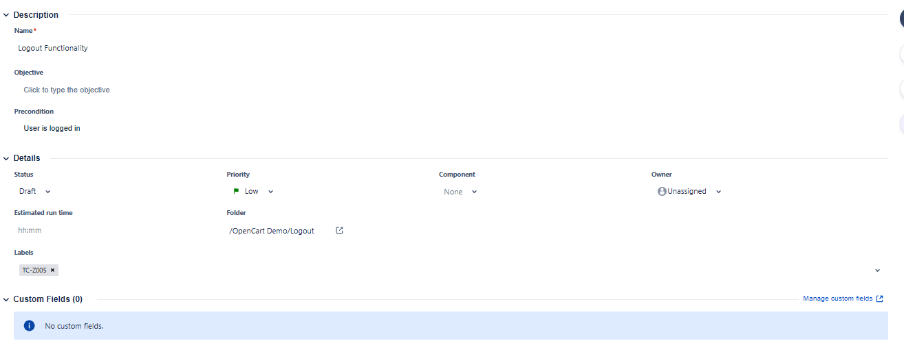

# Zephyr Test Cases – OpenCart Demo  

### TC-Z001: Login with Valid Credentials  
**Objective:** Verify that a registered user can log in with valid credentials and access the dashboard.  
**Precondition:** User account exists with valid username and password.  
**Test Script:**  
1. Open login page  
2. Enter valid credentials  
3. Click login  
**Expected Result:** User is redirected to the dashboard.  
**Execution:** Manual  
**Status:** Approved  
**Priority:** High  

  

  

---  

### TC-Z002: Add Product to Cart  
**Objective:** Ensure users can add products to the shopping cart and the cart count updates correctly.  
**Precondition:** User is logged in.  
**Test Script:**  
1. Open product page  
2. Click "Add to Cart"  
3. Verify cart count increases  
**Expected Result:** Product is added to cart and cart count increases by one.  
**Execution:** Manual  
**Status:** Approved  
**Priority:** Medium  

  

  

---  

### TC-Z003: Checkout Process  
**Objective:** Validate that users can complete a full checkout flow, including billing, shipping, and payment, leading to an order confirmation.  
**Precondition:** User has at least one product in cart.  
**Test Script:**  
1. Open cart  
2. Click "Checkout"  
3. Fill billing/shipping info  
4. Complete payment  
**Expected Result:** Order confirmation page is displayed, and order is recorded in system.  
**Execution:** Manual  
**Status:** Approved  
**Priority:** High  

  

  

---  

### TC-Z004: Search Product  
**Objective:** Confirm that the search functionality retrieves relevant products based on entered keywords.  
**Precondition:** Product exists in database.  
**Test Script:**  
1. Enter product name in search bar  
2. Click search icon  
3. Verify search results match query  
**Expected Result:** Relevant product(s) matching the search term are displayed.  
**Execution:** Manual  
**Status:** Approved  
**Priority:** Medium  

  

---  

### TC-Z005: Logout Functionality  
**Objective:** Verify that logging out ends the user session and redirects to the homepage.  
**Precondition:** User is logged in.  
**Test Script:**  
1. Click logout button  
2. Verify user redirected to homepage  
**Expected Result:** User session ends and homepage is displayed.  
**Execution:** Manual  
**Status:** Approved  
**Priority:** Low  

  
