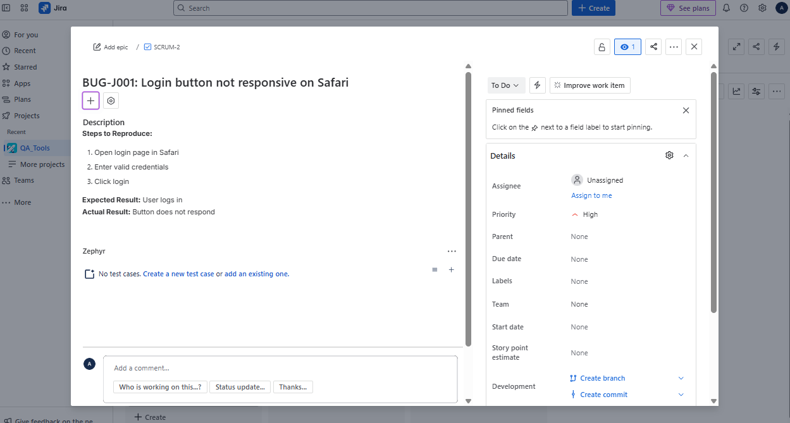
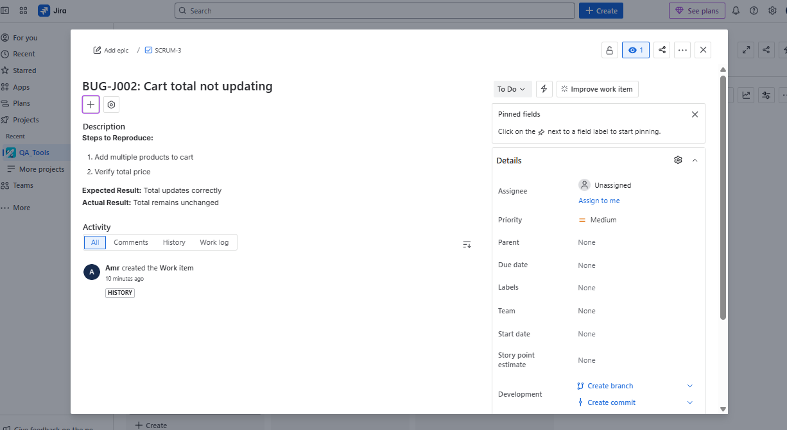
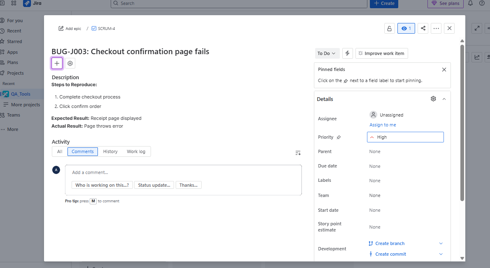
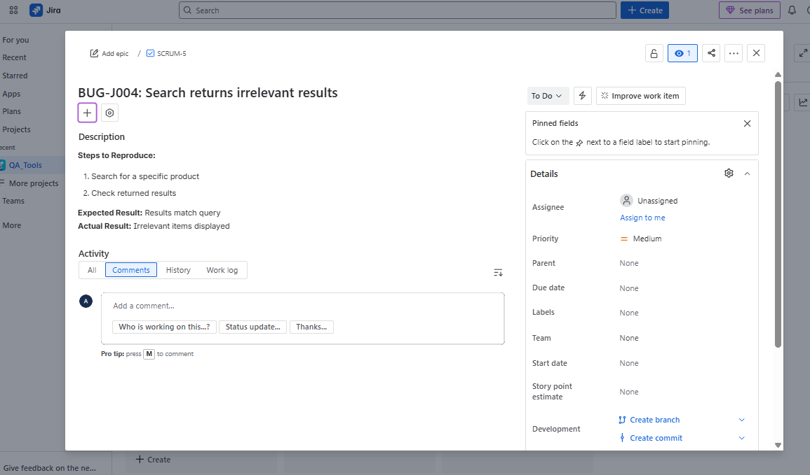

# Jira Bug Reports – OpenCart Demo

### BUG-J001: Login button not responsive on Safari
**Steps to Reproduce:**  
1. Open login page in Safari  
2. Enter valid credentials  
3. Click login  

**Expected Result:** User logs in  
**Actual Result:** Button does not respond  
**Severity:** Critical  
**Status:** Open  

  
---

### BUG-J002: Cart total not updating
**Steps to Reproduce:**  
1. Add multiple products to cart  
2. Verify total price  

**Expected Result:** Total updates correctly  
**Actual Result:** Total remains unchanged  
**Severity:** High  
**Status:** Open  
  

---

### BUG-J003: Checkout confirmation page fails
**Steps to Reproduce:**  
1. Complete checkout process  
2. Click confirm order  

**Expected Result:** Receipt page displayed  
**Actual Result:** Page throws error  
**Severity:** High  
**Status:** Open  
  

---

### BUG-J004: Search returns irrelevant results
**Steps to Reproduce:**  
1. Search for a specific product  
2. Check returned results  

**Expected Result:** Results match query  
**Actual Result:** Irrelevant items displayed  
**Severity:** Medium  
**Status:** Open
  
