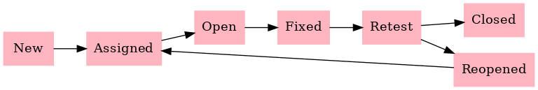

# 🧪 Software Testing Portfolio

 
 
 

Welcome! This repository showcases my **practical software testing portfolio**, demonstrating hands-on skills in **manual testing, automation, API testing, CI/CD, and software development methodologies**.  

All work is **organized by weeks and days**, simulating real-world QA workflows, so recruiters can easily explore my applied knowledge.

---

## **About Me**
I am a **detail-oriented and analytical software tester** with a strong foundation in software testing principles and hands-on experience in Java programming for test automation.  

**Key Skills:**
- **Manual Testing:** Test planning, test case design, defect tracking, exploratory testing  
- **Test Automation:** Selenium WebDriver, TestNG, JUnit, Java, Python scripting  
- **API Testing:** Postman, Newman  
- **CI/CD & DevOps:** Jenkins pipelines, automated test execution  
- **Methodologies:** Agile / Scrum, Waterfall, V-Model  
- **Other Tools & Skills:** Jira, SQL, HTML/CSS/JavaScript, Windows/Linux commands, Git/GitHub  

---

## **Portfolio Highlights**

### **Manual Testing**
- [Bug Report Example](Week1/Day1/bug-report-example.md)  
- [Test Case Sample](Week1/Day1/test-case-sample.md)  
- [Test Plan Example](Week1/Day1/manual-test-plan.md)  
  

### **Test Automation**
- 

### **API & CI/CD**
-

### **Methodologies & Scripting**
-
---

## **Goal**
This portfolio demonstrates my applied software testing skills, with practical examples in **manual testing, automation, API testing, CI/CD, and development methodologies**, all **organized by weeks and days** to clearly show progression and structure.
